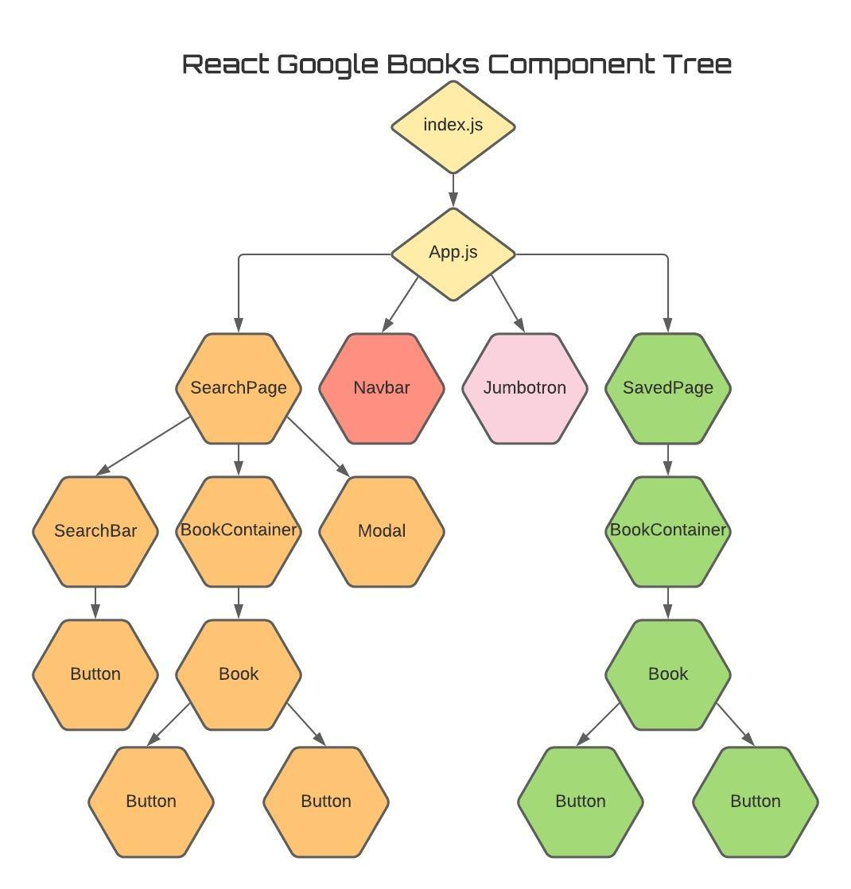

# (React) Google Book Search
Homework# 21 MERN: Google Book Search

[(React) Google Book Search Deploy](https://google-books-nmk.herokuapp.com/)

[](https://github.com/natemking/book_finder/blob/main/LICENSE)


---
## Table of Contents
 * [Description](#description)
    + [Scope of Work](#scope-of-work)
    + [Description](#description)
  * [Screenshots](#screenshots)
  * [License](#license)
  * [Credits](#credits)

## Description

### Scope of Work
User Story:
```
As a user: 
I want to be able to search for books.
I should be able to save results of certain books.
I should also be able to view the saved books. 
I should also be able to delete saved books. 
``` 

### Description

This app is a full-stack MERN app that utilizes a 3rd party API call to Google Books. Initially, the user is presented with the search page. Here React is rendering a `Navbar` component, `Jumbotron` component, and `SearchBar` component. The nav utilizes react-router to create links to the two routes that this page consists of. The jumbo is just a static element. The search page is the default and catch-all page for the app. 

The user can utilize the search bar to input a book title or author and then submit the query. That value is saved in state and sent to the Express.js server via an Axios API Post request. When it reaches the backend, the value is routed to the `apiController` which is handling the Google API call. After the call is made the response is sent back to the front end. React then takes that response data and, first, filters out only the books that have all of the specified requirements (title, authors, description, book cover, and preview link). Then that filtered data is sent to a map method and each book is rendered into its own `Book` component displaying a list of the filtered books that were returned. The book component itself renders two buttons. One is a View button which when clicked sends the user to a Google Books preview page allowing the user to sample the book they saved. The other button is a Save button. When the user clicks this button the book's data is set to state and sent to the server via an Axios post request. The server then routes that request to the `dbController` and the books are added to the Mongo database. The user is notified of a successful save by the `Modal` component that appears on the screen. 

When the user navigates to the Saved page, a `useEffect` hook is used to run a function called `loadBooks()`. This function sends an Axios GET request to the server. The server then sends the request to `dbController` where it finds all books that are stored in the MongoDB and responds with the data. This data is then mapped on the search page and each book is rendered into its own `Book` component. Again the `Book` component renders two buttons but this time there is a Delete button with the View button. All of the buttons in this app are rendered from the singular `Button` component. How the button displays and operates are all controlled via props. When the user clicks the delete button the id of that book is sent to the server and then to the controller to be deleted. Lastly, the `loadBooks` function is called again to render the new list.  

I have also added a service worker to for this app to be a PWA.


## Dependencies
```
|-----------------------------------------|
|Server             |Client (not from CRA |
|-------------------|---------------------|
|axios              |axios                |
|compression        |bootstrap            |
|dotenv             |react-bootstrap      |
|express            |react-router-dom     |
|if-env             |                     |
|mongoose           |                     |
|morgan             |                     |
|concurrently (dev) |                     |
|-----------------------------------------|
```

## Screenshots


<br>
_App Functionality_
<br>

<br>


<br>

## License
Licensed under the GNU GPLv3.0 License. Copyright © 2020

## Credits

* [Add a comma to map results if there are more then one result](https://stackoverflow.com/questions/47881767/how-to-add-a-comma-in-array-map-after-every-element-except-last-element-in-react)

* [Get child element of event.target](https://stackoverflow.com/questions/48494416/get-child-element-from-event-target)

---

GitHub: [@natemking](https://github.com/natemking/)

Email: [natmeking@gmail.com](mailto:natmeking@gmail.com)

